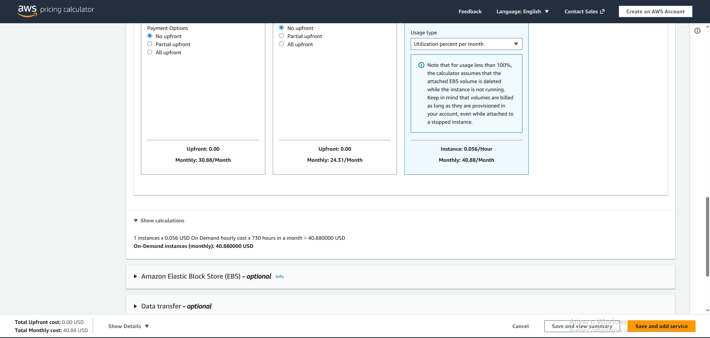

# ☁️ Planejamento e Arquitetura de Instâncias EC2 na AWS

Este repositório contém a documentação técnica e o planejamento de infraestrutura para o laboratório **"Gerenciando Instâncias EC2 na AWS"** da DIO. 

> **Nota de Implementação:** Devido a restrições de provisionamento (bloqueio de ativação por cartão de crédito), este projeto foi desenvolvido com foco em **Arquitetura de Soluções e FinOps**, mapeando teoricamente todas as etapas de configuração, segurança e estimativa de custos sem o provisionamento desnecessário de recursos faturáveis.

## 🎯 Objetivos de Aprendizagem

- Mapeamento de provisionamento seguro de instâncias Amazon EC2.
- Estruturação teórica de volumes elásticos (EBS) e rotinas de Snapshots.
- Previsibilidade de orçamento e otimização de custos utilizando a AWS Pricing Calculator.

---

## 🛠️ Especificações da Infraestrutura Planejada

A infraestrutura foi desenhada para utilizar recursos otimizados e elegíveis ao nível gratuito (Free Tier):

- **Tipo de Instância:** `t2.micro` (1 vCPU, 1 GB RAM)
- **Sistema Operacional (AMI):** Amazon Linux 2023
- **Armazenamento (EBS):** 8 GB, General Purpose SSD (gp3) - *Escolhido pela maior performance de IOPS base (3.000) com menor custo que a geração gp2.*
- **Segurança (Security Group):**
  - **Inbound:** Porta `22` (SSH) restrita ao IP do administrador (evitando exposição global `0.0.0.0/0`).
  - **Outbound:** Tráfego totalmente liberado para atualizações do sistema.

---

## 📊 Simulação de Custos e Planejamento (FinOps)

Foi realizada uma projeção de custos para manter o servidor operando 24/7 (730 horas/mês) utilizando a calculadora oficial da AWS.

> **Estimativa Mensal Total:** ~$X.XX USD *(Insira o valor da sua simulação aqui)*

---

## 🚀 Roteiro de Provisionamento (Step-by-Step)

Se o ambiente estivesse liberado para execução via Console, os passos rigorosos seriam:

1. **Geração de Chaves:** Criar um par de chaves (Key Pair) no formato `.pem` para garantir acesso remoto seguro via SSH.
2. **Lançamento da EC2:** Selecionar a AMI do Amazon Linux 2023, atribuir a instância a uma Subnet Pública e anexar o Security Group configurado.
3. **Validação de Acesso:** Executar o comando via terminal local: `ssh -i "chave.pem" ec2-user@<IP_PUBLICO_AWS>`.
4. **Estratégia de Backup:** Navegar até o painel de volumes EBS e gerar um Snapshot manual do volume raiz para criar um ponto de restauração seguro.
